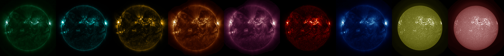
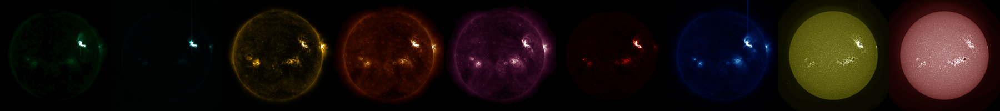
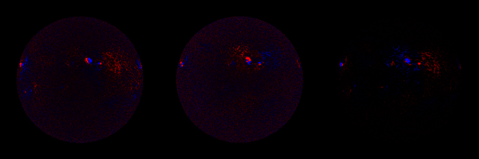
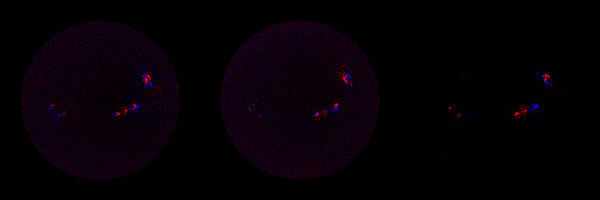

Miniature SDO Dataset
=====================

This is a substantially temporally downsized version of the SDO Dataset
of [A Machine-learning Data Set Prepared from the NASA Solar Dynamics Observatory
Mission](https://iopscience.iop.org/article/10.3847/1538-4365/ab1005/pdf), 
(Galvez, Fouhey, Jin, Szenicer, Munoz-Jaramillo, Cheung, Wright, Bobra, Liu, Mason, Thomas),
APJs 2019 
aimed primarily at being an easily accessible version
of the dataset to get started with. Hopefully it's useful and a more productive
and inspirational way of testing machine learning algorithms than yet another
horribly contrived version of MNIST.

**Here's a [preview movie](http://web.eecs.umich.edu/~fouhey/2019/apjs/vis.mp4).**

What's in here?
---------------

The data comes from the
[Solar Dynamics Observatory](https://en.wikipedia.org/wiki/Solar_Dynamics_Observatory),
a NASA spacecraft that's been observing the Sun since February 2010. In
particular, the dataset contains ~60K observations, each separated by an hour,
from three instruments over a period of about 8 years covering 12 modalities.
These observations are synchronized spatially and temporally with no missing
data for the image data. In particular, the dataset contains data from these sensors:

1. SDO/AIA (Atmospheric Imaging Assembly): 
This observes the sun at high
resolution at 10 wavelengths. We've provided 9 of these channels,
specifically the ultraviolet ones: 94A, 131A, 171A, 193A, 211A, 304A, 335A,
1600A, 1700A (where 1 A (angstrom) = 10 nanometer). I dropped 4500A, since it's often 
missing. The data was originally 4096x4096 and is now 512x512.
Here is what a typical point in time looks like (in wavelength order and visualized
with the correct colormap): 



Here's a more fun datapoint, an X9 flare -- the super bright spot is far brighter than
everything else: 



2. SDO/HMI (Helioseismic and Magnetic Imager): This observes the sun at high resolution and
produces a vector field (Bx,By,Bz) of the magnetic field of the sun.  This data
is 512x512. Note the alignment between the strong field and the bright spots in
AIA. Here is what a typical point in time looks like (in the order of bx/by/bz and
visualized with a blue(-)/black(0)/red(+) colormap): 



Here's the same X9 flare: 




3. SDO/EVE (Extreme Ultraviolet Variability Experiment): This observes the sun at more
wavelengths, and much higher temporal rate but at no spatial resolution (i.e., it's a scalar
per wavelength).

The dataset has, for approximately 60K timesteps, the corresponding AIA and HMI observations,
and until the date when the EVE MEGS-A sensor had an electrical short, the corresponding
EVE observation.


How do I load the data?
-----------------------

The data is stored:

- *AIA*: as a set of images of the form ({$year}/AIA/{$wavelength}/{$month}/{$day}/AIA{$year}{$month}{$day}_{$hour}{$minute}_{$wavelength}.npz) e.g.,
2013/AIA/0211/11/25/AIA20131125_0824_0211.npz 
- *HMI* : as a set of images of the form ({$year}/HMI/{$wavelength}/{$month}/{$day}/HMI{$year}{$month}{$day}_{$hour}{$minute}_{$wavelength}.npz) e.g.,
2013/HMI/bz/11/25/HMI20131125_0824_bz.npz 
- *EVE*: as a single numpy file EVE/irradiance.npy, where each row is a date in time. Any invalid datapoint is set as -1, which you should specially handle
or delete. The ones primarily of interest are from MEGS-A: [0, 1, 2, 3, 4, 5, 6, 7, 8, 9, 10, 11, 12, 14] (note the missing 13); Indices 15 and higher are rarely observed.

Each image is stored as a variable 'x' in each npz. For compression reasons,
the data is stored as float16 if the data fits and float32 otherwise. You
should immediately, however, convert the data to at least float32.

The instruments' data are joined by join.csv, which has the form

```
eve_ind,reduced_ind,time,94,131,171,193,211,304,335,1600,1700,bx,by,bz
...
22154,1874364,2013-11-25 08:24:00,2013/AIA/0094/11/25/AIA20131125_0824_0094.npz,2013/AIA/0131/11/25/AIA20131125_0824_0131.npz,2013/AIA/0171/11/25/AIA20131125_0824_0171.npz,2013/AIA/0193/11/25/AIA20131125_0824_0193.npz,2013/AIA/0211/11/25/AIA20131125_0824_0211.npz,2013/AIA/0304/11/25/AIA20131125_0824_0304.npz,2013/AIA/0335/11/25/AIA20131125_0824_0335.npz,2013/AIA/1600/11/25/AIA20131125_0824_1600.npz,2013/AIA/1700/11/25/AIA20131125_0824_1700.npz,2013/HMI/bx/11/25/HMI20131125_0824_bx.npz,2013/HMI/by/11/25/HMI20131125_0824_by.npz,2013/HMI/bz/11/25/HMI20131125_0824_bz.npz
...
```

Each line corresponds to a data point:
- *eve_ind*: the index into irradiance.npy, or None if the data point is not valid
- *reduce_ind*: the index into the original irradiance.npy file
- *time*: the time of the observation
- *(94/131/171/193/211/304/335/1600/1700)*: the corresponding AIA files
- *(bx/by/bz)*: the corresponding HMI files


What special libraries do I need?
---------------------------------

You need:
- **numpy** for loading the data
- *sunpy* if you'd like to visualize things the way space physics people like to see them

How do I get the data?
----------------------

We store all the data in a series of .tar files, one per-year, plus EVE and the metadata
[here](http://fouheylab.eecs.umich.edu/~fouhey/MiniSDO/).

If you like what you see, and you're ready for the real dataset, try
downloading it from [the Stanford Digital Repository](https://purl.stanford.edu/nk828sc2920).

FAQ
---

**Q. It seems as if there's missing observations looking at the dates?**

**A.**  SDO itself will have some missing observations due to calibration
maneuvers and anomalies. To prevent ambiguity in the handling of partial
observations and apples-to-oranges experiments, Mini SDO has only full
observations. The full dataset has the partial  observations  (i.e., if there's
a 8/12 observation, the 8 valid ones are there). 


**Q. How do you cite this?**

**A.** If you find this data useful, cite it as
```
@article{Galvez2019,
    author = {R. Galvez and D.F. Fouhey and M. Jin and A. Szenicer and A. Munoz-Jaramillo and M.C.M. Cheung and P.J. Wright and M.G. Bobra and Y. Liu and J. Mason and R. Thomas},
    title  = {A Machine Learning Dataset Prepared From the NASA Solar Dynamics Observatory Mission},
    journal = {The Astrophysical Journal Supplement},
    volume = 242,
    number = 1,
    year = 2019
}
```


